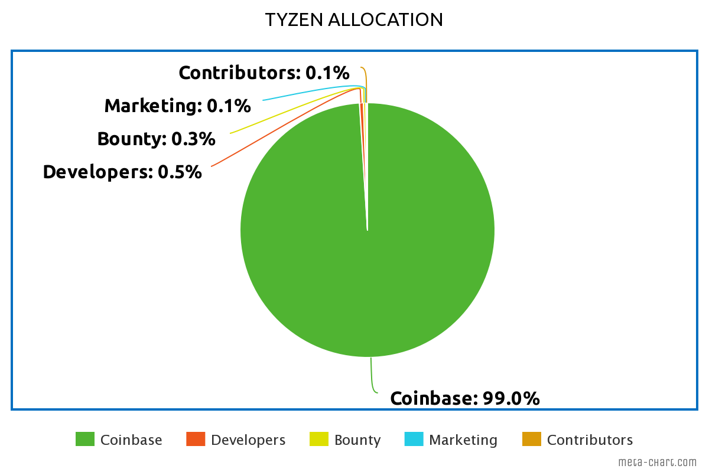

# Get Started

To download Tyzen Core, visit [www.tyzen.io](https://www.tyzen.io/downloads)

## Introduction 

[_Tyzen_ ](https://www.tyzen.io/)_or TZN is an electronic currency that is often referred to as cryptocurrency, Tyzen uses a peer-to-peer blockchain network that connects one network to another to maintain the security of the_ [_Tyzen_](https://www.tyzen.io/) _system from threats in the form of hacker attacks or illegal data changes by irresponsible people. responsible for personal gain._

One notable innovation is the blockhain protocol, which was pioneered by the cryptocurrency Bitcoin. In 2009, when someone or a group of people using the name Satoshi Nakamoto launches the open source code for the Bitcoin software. Bitcoin introduces elegant solutions to several challenges as well as incentives for network nodes to stay up, make the Bitcoin network grow and strengthen it.

As we already know, many cryptocurrencies emerge every day carrying the same mission but do not have a big influence on the development of blockchain technology because many of them only use the same source code and only replace it a little without considering what functions and problems will be fixed.

With this opportunity in mind, our creation of Tyzen and the TZN Platform appeared in June 2022, after going through a difficult time in development and conducting various tests to prevent bugs or problems in the future, we are ready to publish a digital currency called Tyzen to everyone. with the aim of shortening transaction times and providing the lowest fees to users with the best quality and security.

## _Tyzen Allocation_

## Running

The following are some helpful notes on how to run Tyzen Core on your native platform.

### Linux

Unpack the files that you downloaded into a directory and run:

* `tyzen-qt` (GUI) or
* `tyzend` (headless)

### Windows

Unpack the files into a directory, and then run tyzen-qt.exe.

