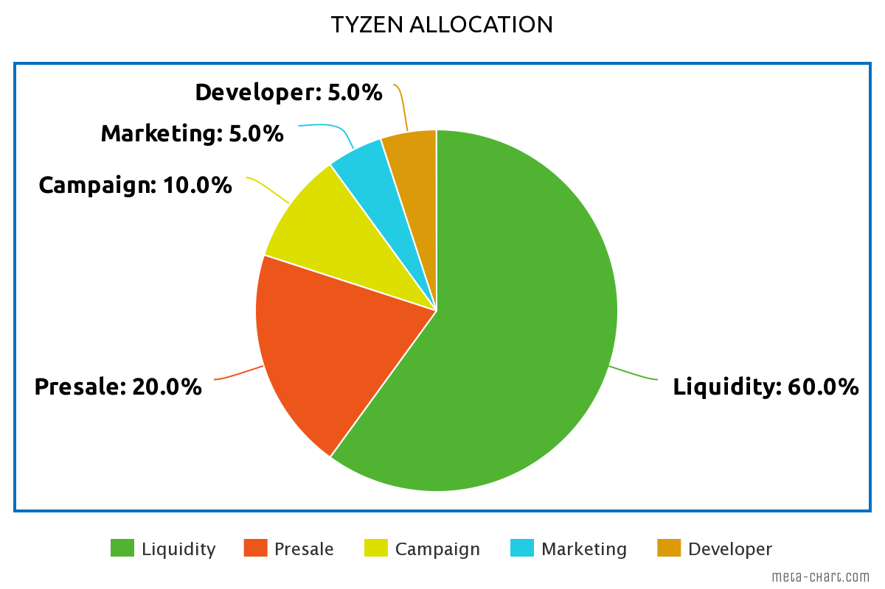

# ℹ Tyzen Bep-20

## What is Tyzen BEP-20 ?

Tyzen Token is a bep-20 version of the Tyzen coin issued under the Binance Smart Chain (BSC) network as a price support for the Tyzen coin without affecting the development of the price of the Tyzen Token itself.

The simple system that is made is that every transaction made using Tyzen Token will generate a commission in the form of BNB which will then be used in the development of the Tyzen Blockchain, Marketing, and keeping Tyzen (Tyzen coin & Tyzen Token) from experiencing a significant price decline in a short time.

